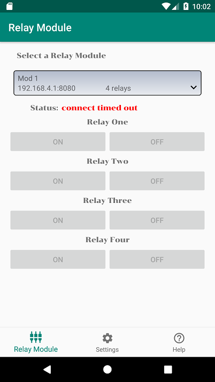
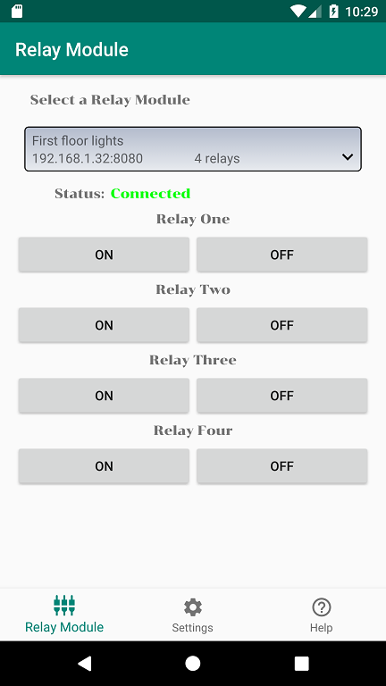

# ESP8266 ESP-01 WiFi Relay Commander
### This is an Android App to send commands to WiFi Relay Module based on ESP8266 ESP-01
- Relay module is available on eBay https://www.ebay.com/itm/164267276562
- You need another app from play store to configure the relay module to connect to your WiFi network https://play.google.com/store/apps/details?id=com.cmmakerclub.iot.esptouch
- After configuring the relay module to connect to your WiFi network you can use my app to switch on / off the individual relay
- Refer to the screenshots below

- In the bottom navigation, select "Settings". In this screen, you can add as many relay modules you want.
- Specify the IP address and port of the relay module
- Give a Friendly Name such as "First Floor Lights", "Backyard Lights" so that you an easily identify the appliances it controls
- Specify the number of relay modules (currently supports up to four only) and hit Add Relay Module button to save it

- Once you have added the relay module, navigate to "Relay Module" in the bottom navigation
- You will see a list of relay modules you have added earlier in "Settings" screen
- By default, first relay module will be selected
- Below the selection, it displays the connection status

- If the relay module is found in the WiFi network, the text will change to "Connected" and it will be in green color
- Once connected, the buttons will be enabled. Buttons will be disabled if there is any issue while connecting to relay module.
- Once enabled you can select ON or OFF of the required Relay Module

